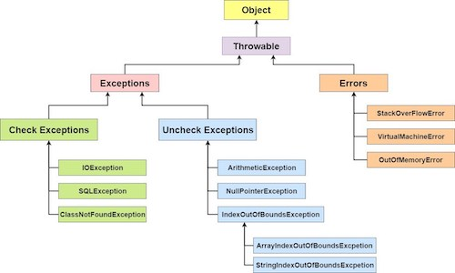

# Exception

## <mark style="color:yellow;">Throw와 Throws의 차이는 무엇인가요?</mark>

&#x20;**Throws**

메서드에서 잠재적으로 어떤 Exception 이 발생 할 수 있는지 명시할때 사용한다.

**Throw**&#x20;

Exception을 발생 시킬 때 사용한다.

ex.

<figure><figcaption></figcaption></figure>

## <mark style="color:yellow;">Final, Finally, Finalise의 차이는 무엇인가요?</mark>

**final**&#x20;

클래스, 메서드, 필드가  수정이 불가하도록 설정할때 사용한다.

**finally**&#x20;

try catch 문 사용 시에  Exception이 발생하든 안하든 실행되는 동작을 설정할때 사용한다.

**finalise**

소멸자 메서드 라 칭하며 GC가 사용하지 않는 배열, 객체 등을 힙 영역에서 삭제하는 메서드이다.

## <mark style="color:yellow;">Try-Catch-Finally에서 생략할 수 있는 부분이 무엇인가요?</mark>

Finally 는 필수가 아니므로 생략이 가능하다.

try - finally 사용 시 catch 문 생략이 가능하다.

## <mark style="color:yellow;">Catch가 반환되면 finally가 실행되나요?</mark>

**finally 실행 조건**&#x20;

예외가 없을 때 'try' - 'finally' 순으로 실행

예외가 있을 때 'try' - 'catch' - 'finally' 순으로 실행

## <mark style="color:yellow;">Exception 클래스의 예시를 말해주세요.</mark>

<figure><figcaption></figcaption></figure>

* Throwable&#x20;

모든 예외 처리 클래스들의 부모같은 클래스 이다. 해당 클래스에 속해있다면 Throw 를 통해 해당 오류 내용을 상위 메소드로 전달할수있다.

* Errors

주로 코드 상 문제 보다는 시스템 단에  오류를 포함하고 있다.&#x20;

많은 자바 관련 서적에서도 굳이 catch 로 잡거나 따로 처리하는 로직은 권하지 않는다고 말한다.

그렇기에 Errors 에 오류가 발생 시 해당 프로그램을 종료하고 오류의 근본적 원인을 해결하는것이 바람직한 방법이다.

* Checked Exception

필수적으로 예외처리를 해주어야 하는 클래스 이다.&#x20;

예외처리를 하지않으면 컴파일 단계에서 오류가 발생한다. 그래서 주로 메서드 옆에 throws 라고 명시해주는 방식으로 예외처리를 해주거나 해당 오류를 Unchecked Exception 으로 잡아서 처리해준다.

* UnChecked Exception

필수적으로 처리 해주지 않아도 되는 클래스이다.&#x20;

예외처리를 하지 않아도 컴파일 단계에서 오류가 발생하거나 IDE 에서도 따로 throws 를 작성하라고 권하지 않는다.  그렇다고 처리를 안해도 된다는 뜻은 아니다.

