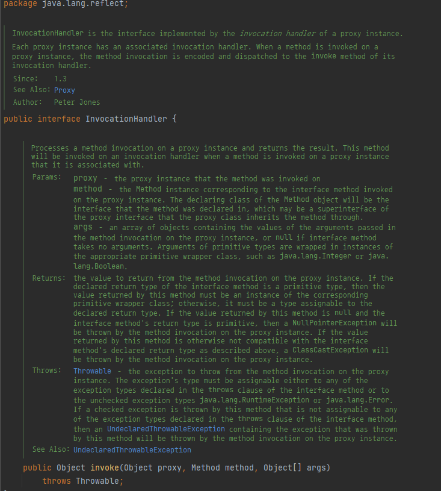

# \[Lv.1] 카드 뭉치

<figure><figcaption></figcaption></figure>

```
class Solution {
    public String solution(String[] cards1, String[] cards2, String[] goal) {
        int i1 = 0;
        int i2 = 0;


    for (int i = 0; i < goal.length; i++){
        if (i1 < cards1.length && cards1[i1].equals(goal[i])){
                i1 += 1;
        }else if (i2 < cards2.length && cards2[i2].equals(goal[i])) {
                i2 += 1;
        }else
            return "No";
        }
            return "Yes";
    }
}
```


### 풀이

처음엔 카드 뭉치 두개를 2차원 배열로 바꾼 뒤 goal 과 비교한 뒤 맞으면 빈 리스트 (result)에 문자열을 추가하고 goal이 result 와 같은지 비교하면 되겠다 생각했다.&#x20;

하지만 조건에 카드를 사용하지 않고 다음 카드로 넘어갈 수 없다는 조건을 만족 시킬 수 없었다.

그래서 고민하다 No 가 나올 수 있는 경우의 수를 생각해보고 두 카드뭉치 에서 일정 인덱스에 문자열이 모두 goal 과 해당 하지 않는다면 No 가 나와야 되지만 그냥 For문을 돌리면 각 카드뭉치 별로 인덱스를 지정하기가 어려우므로! 인덱스 역할을 할 int를 각각 선언해주고 해당 인덱스를 기준으로 각각 비교하는 방식으로 풀이하였다.
