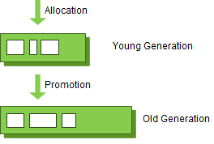

# GC (Garbage Collection)

### Garbage Collection&#x20;

우리가 변수를 만들고 값을 지정하는 일련의 과정들에서의 행위들은 대부분 메모리를 할당받는 경우가 대다수 이다. 하지만 이러한 할당받은 메모리들을 다시 반납하는 로직을 따로 작성해본적은 없다.

자바, 코틀린 같은 언어를 사용한다면 더더욱 이러한 로직을 작성하지도 메모리관리 라는 단어도 생소할것이다.&#x20;

이러한 유효하지 않은 메모리. 즉 다 사용한 메모리 를 Garbage (쓰레기) 라 부르며 그것을 관리해주는 역할을  GC (Garbage Collection) 가 대신 맡아준다.

보통 C 에선 이러한 GC를 직접 만들어야 한다고 알고있다.

### GC 의 동작 방식

GC 동작방식은 Minor GC 와 Major GC 로 나뉜다.&#x20;

어떤 영역에 있는 GC를 관리하냐의 차이가 있다.

JVM 에 힙 영역에는 YOUNG, OLD 영역으로 나뉜다.

<figure><figcaption></figcaption></figure>

여기서  YOUNG 영역은  EDEN 1개, SURVIVOR 2개의 영역으로 구성되어있다.

1. 객체가 생성되고 메모리를 할당  받았기에 EDEN 영역으로 들어온다.&#x20;
2. 이런 식으로 EDEN 영역에 객체가 쌓이다 꽉 차게 되면 MINOR GC가 동작한다. 그 중 살아남은 객체는 SURVIVOR-1 으로 옮겨진다.
3. 게속 반복하다 SURVIVOR-1도 꽉차게 되면 다시 GC가 동작하면서 살아남은 객체는 SURVIVOR-2 로 이동한다.
4. &#x20;SURVIVOR-2 에서도 살아남은 객체는 OLD 구역으로 이동한다.

OLD 영역은 따로 영역이 나뉘지는 않고 위 같은 싸이클을 거쳐 OLD로 오게된 객체로 인해 OLD 영역이 꽉차게되면 그때 MAJOR GC 가 동작한다.

### STOP THE WORLD,  MARK AND SWEEP

위에는 각 영역별로 다른 동작방식이지만 두 GC 모두 공통적인 동작방식이 있다.

#### STOP THE WORLD

이름 그대로 멈추는것이다. GC가 동작될 동안에는 GC를 제외한 모든 스레드 들이 멈춘다.

즉 애플리케이션 동작이 멈추는것이다. 그렇기에 시간이 오래 소요될 경우 운영에 굉장히 치명적이다.

보통 GC 를 튜닝한다는 얘기는 이러한 STOP THE WORLD 의 소요시간을 줄이는 것을 의미한다.

#### MARK AND SWEEP

STOP THE WORLD 로 애플리케이션을 중단 시키면 스택을 돌아다니며 사용중인 객체(메모리) 에 MARK 를 표시한다.  이런 행동을 MARK 라 표현한다.

또 이러한 MARK 가 되있지않은 객체는 삭제하는데.이러한 삭제하는 행동을 SWEEP 이라 한다.

Minor GC는 비교적 동작 속도가 빠른편이다. 그렇기에 애플리케이션에 큰 영향이 없지만 Major GC는 훨씬 더 오래걸리는 편이라 운영에 꽤 큰 영향을 줄 수 있다.&#x20;

