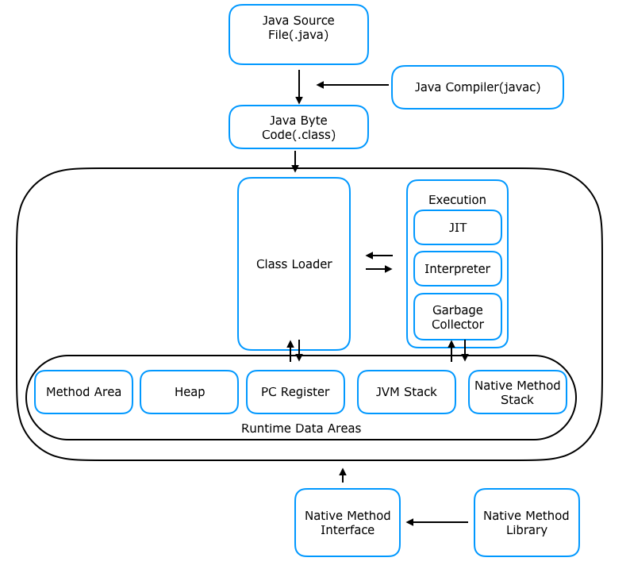

# JVM 동작 방식

### JVM&#x20;

JVM 은 Java Virtual Machine 의 약자이다.

자바는 어떤 OS 든 실행되어지는데 JVM 이 그 역할을 하고 있다.

간단한 동작원리를 말해보자면

자바 언어로 작성된 자바파일을 자바 컴파일러가 바이트 코드로 변환 시켜 준다.

이렇게 변환된 코드를 JVM 이 해석하고 실행하는 방식으로 동작한다.

전체적인 흐름도는 아래 와 같다.

<figure><figcaption></figcaption></figure>

자바 소스 파일이 자바 컴파일을 통해 바이트코드로 변환되어서 클래스 로더로 향한다.

Class Loader

Load, Linking, initialize  와 같이 3단계로 나뉘어져있다.

Load : 클래스 파일을 JVM 메모리에 로드한다.

Linking : 해당 클래스 파일이 JVM 명세와 일치하는지 체크하고 필요로 하는 메모리에 할당한다.

Initialize :  클래스 변수들을 적절한 값으로 초기화 한다.

&#x20;바이트코드를 동적 로드 하여 Runtime Data Areas 로 할당시켜준다.

동적로드 라는 의미는 불러올때 전부를 불러와서 할당 시키는게 아닌 필요할때마다 그때 그때 동적으로 로드 한 뒤 할당 시켜준다.

Excution Engine

인터프리터,  JIT  컴파일러 를 혼합해서 바이트코드를 해석하고 읽어낸다.

JIT 컴파일러는 클래스파일을 네이티브 코드로 변환하여 캐싱 하는 방식으로 동작한다.

하지만 바이트코드를 네이티브 코드로 변환하는 비용이 들기  때문에

인터프리터 방식을 사용하다 일정 기준을 넘어서면 JIT  컴파일러를 사용한다.

또한 GC 도 여기서 동작한다.

METHOD AREA

* 주로 클래스변수, 메서드, 생성자 등이 저장되는 공간
* 어디서든 접근 가능

STACK

* Premitive 형 지역변수, 객체 참조 변수가 저장되는 공간
* 쓰레드 당 1개 씩 생성
* 해당 쓰레드만 접근 가능

HEAP

* 참조형 객체, 변수 등이 저장되는 공간
* 어디서든 접근 가능

PC Register

* 쓰레드 당 1개 씩 생성
* 해당 쓰레드 명령어 주소를 저장하는 공간

Native Method Stack

* JIT 컴파일러에서 바이트코드를 네이티브로 변환해서 사용할때 해당 네이티브 코드가 실행되는 곳
* Native Method I와n 연동해서 동]vfsddasds\\\dasdasda\\

